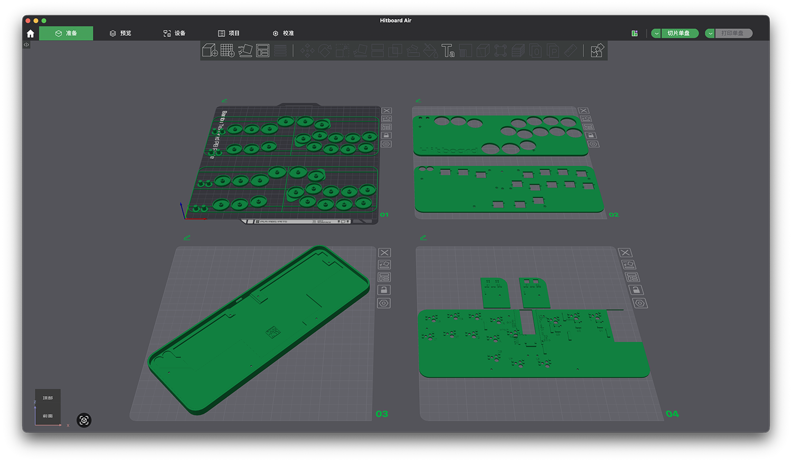
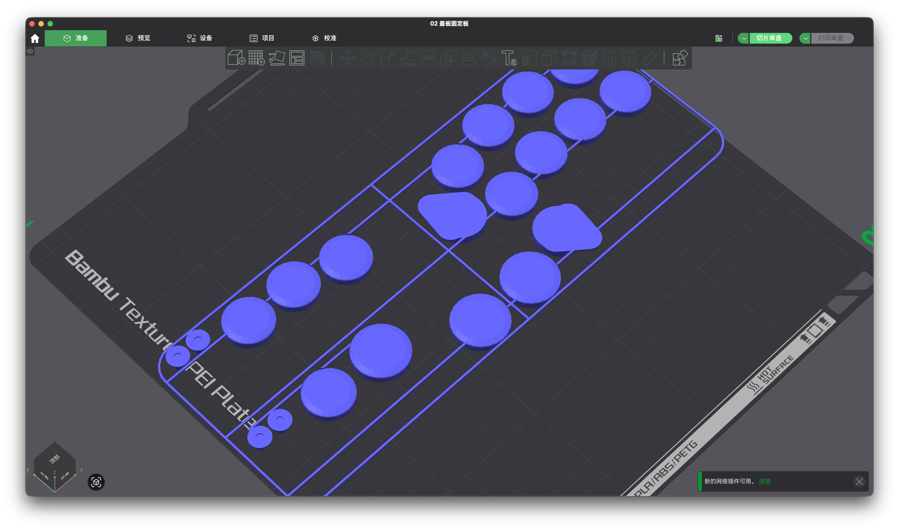
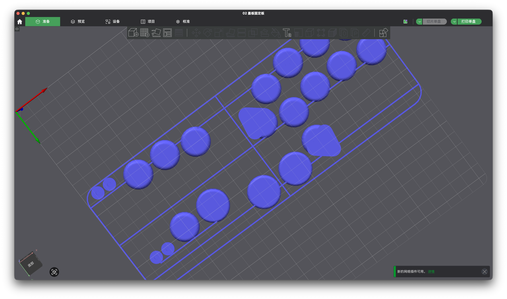
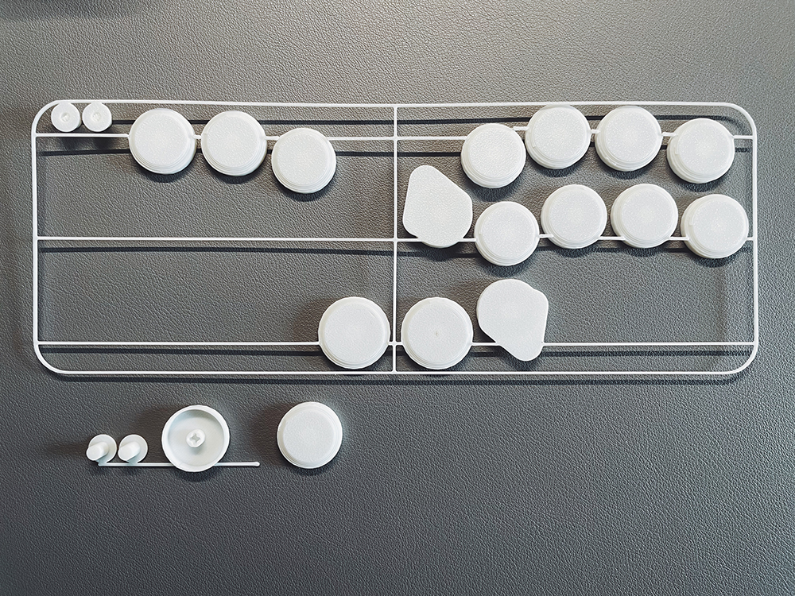
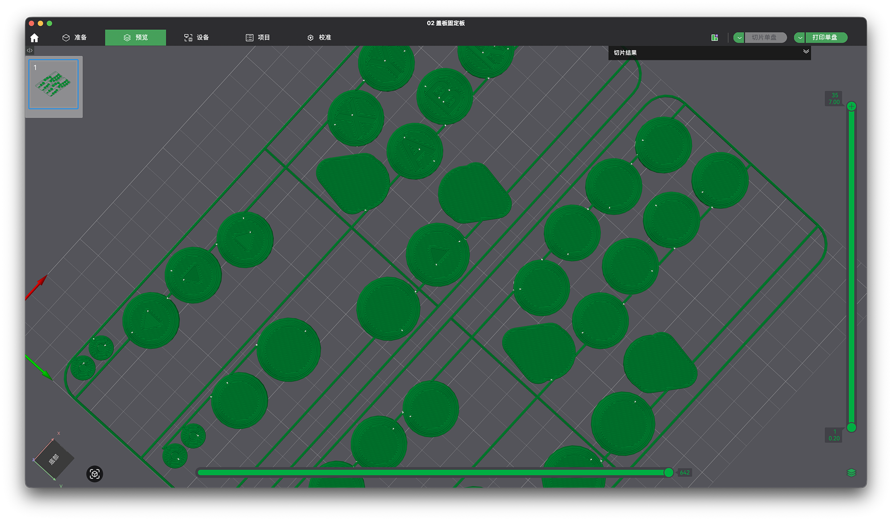
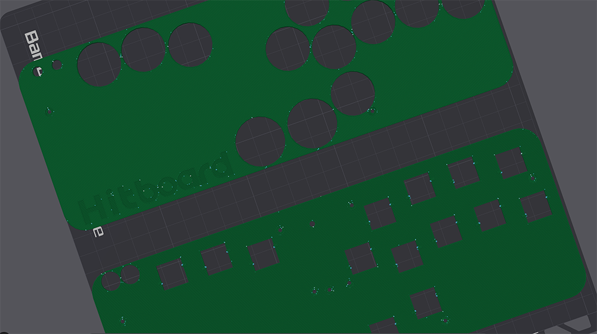
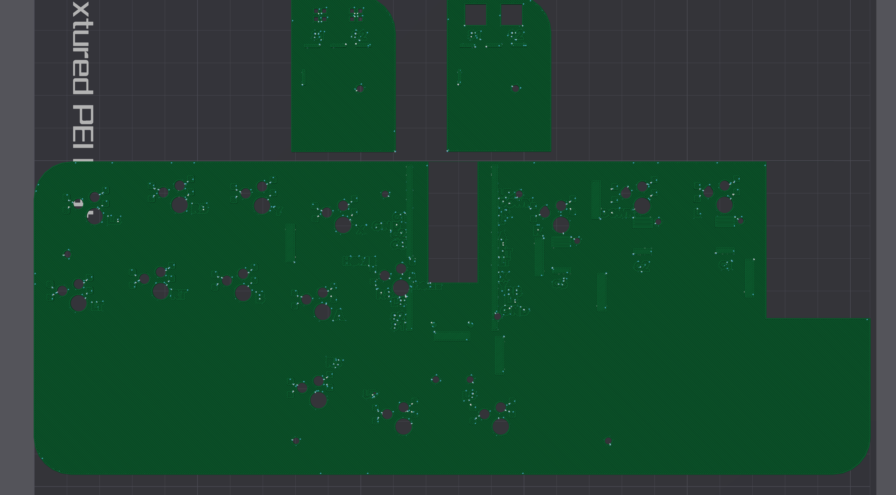
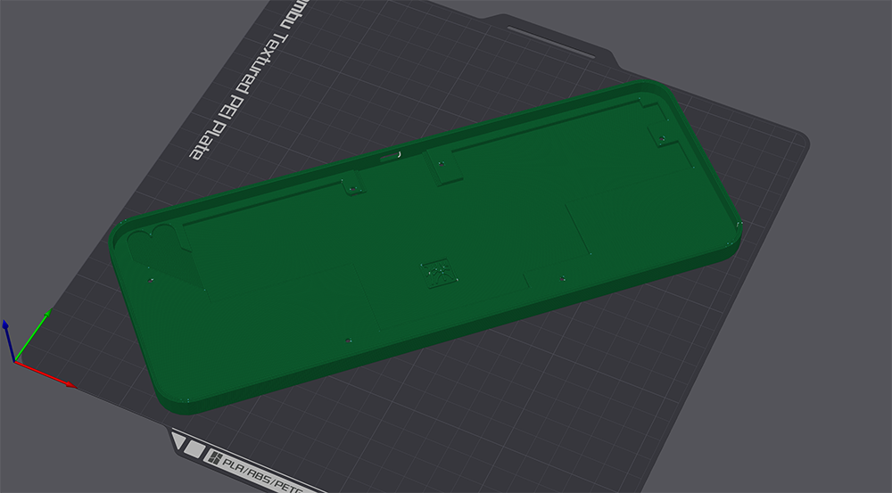

### Hitboard Air - 3D打印设置

#### 1. 文件说明

00_按键

按键有硬朗、圆润，两种风格。

针对 3D 打印键帽特点，测试不同的组合后，提供 4 种最优效果的按键。分别是：
    
    00_Hitboard_Air_硬朗按键_全按键_无刻_带框_反打
    
    00_Hitboard_Air_硬朗按键_全按键_有刻_带框_反打
    
    00_Hitboard_Air_圆润按键_全按键_无刻_带框_反打
    
    00_Hitboard_Air_圆润按键_全按键_无刻_带框_正打
    
反打按键的特点是，利用热床的颗粒，反打获得的表面随机颗粒效果，可以欺骗触觉（类似相机上的颗粒喷涂）。
    
正打能提供比较好的表面平整度。缺点是按键的确认感会不清晰。所以只提供效果最好的圆润按键来正打。
    
有刻/无刻，有刻按键整体视觉上会好看一些，但会牺牲手感。推荐无刻。 
    
省流：请选择 00_Hitboard_Air_硬朗按键_全按键_无刻_带框_反打
    
// 注意：反打按键，需要在软件里把文件翻个朝向（也可以点击软件的「自动朝向」）。
    
ButtonsSystem

按键通过中框串联，不会掉的到处都是。能一定程度防止运输过程丢按键。每套按键都提供了一组独立的备用按键，包含 2 个功能键、1 个 23mm 按键，1 个 26mm 按键。
        
中框已升级为 ButtonsSystem2.0，可以轻松的从框体取下键帽。喜欢拼高达，喜欢口水钳剪零件的同学可以打印这两套按键。
        

More 文件夹

提供了更多的按键选项，进阶 3D 打印玩家可以多尝试不同的组合。
    
    
后续会持续研究 3D 打印按键，欢迎大家反馈这方面的需求。

    
01_盖板

用作产品上盖。
    

    
// 如果有自定义壁纸的需要。可以拿 CAD 文件，去花几块钱买一个 3mm 磨砂亚克力盖板。
    
    
盖板新增了 Logo
    
        “跟人约战街霸，对方没听过 Hitboard。你掏出设备，一个没有 Logo 的 3D 打印件——对方看了一眼，没说话。”

        “你知道他在想什么：山寨货。”

        “尴尬。”

        “Logo 不一定为了让别人认出来。有时候，是为了不让别人认错。”
    

    
02_定位板

// 定位板、轴座板，支持凯华矮轴：猎隼 mini、紫鸳、孤岛粉 mini、星磁 mini 等

用于支撑、固定机械轴。
    
安装轴体时，可以用手指按紧机械轴左侧的塑料臂，然后再往里按。这样能有效提升卡位结构的寿命。
    
        

 

03_线路板
    
用于安装轴座、Pico 主板、飞线、功能键微动按钮。
    
线路板有凹印文字，标记了引脚。飞线时可参考标记接线。
    

    
「more」目录，提供了单独的「功能键小板」文件。方便单独补零件。

    
04_底壳
    
底壳提供 9.3mm（超薄）、9.7mm（中薄）两个文件。
    
这里优先推荐 9.3mm 外壳，因为 9mm 左右恰好能让键盘的厚度没有存在感，不硌手。9.7mm 的厚度，键盘底部边缘会有存在感，请知。

#### 2. 打印设置

01、02、04 板子，按默认面打印。00按键、03板子，需要在打印软件里翻个面。// 点击拓竹的自动翻面就可以

用不用支撑差别不大，可以开启树状支撑保险一点。

// 经常为了赶时间开狂暴模式打印，狂暴模式下出品质量也可以，因为基本都是垂直件没有悬浮。

#### 3. 打印材料

Hitboard Air 是基于 PETG 材料设计，有足够的强度和耐久度，计划长时间使用的话推荐使用 PETG 作为打印材料。

// 鉴于很多人的 3D 打印机只能打 PLA，对 PLA 也做了打印测试：精度、强度都还不错。长时间使用耐久度待观察。

// 注意！PLA 高温下容易形变，打印完成后，务必等板子冷却后，再取。否则可能会让板子弯曲。 
