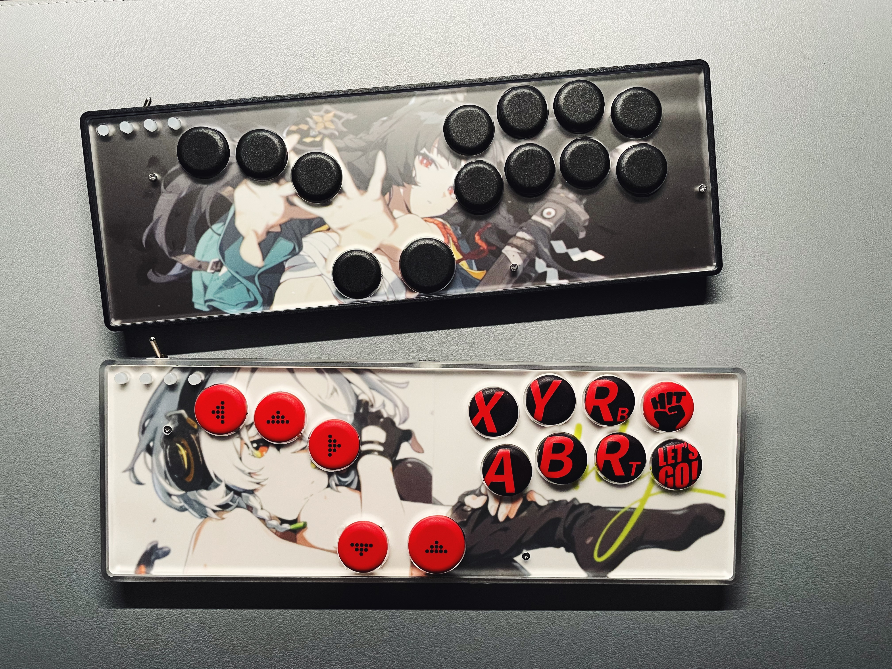

### HITBOARD 开源项目

Hitboard 是一个开源 Hitbox 项目，包含 Zero、Air 等不用型号以适应不同用户、不同场景的需求。它诞生于一个简单的需求：为何不能有一台既拥有键盘的紧凑布局，又具备 Hitbox 专业输入体验的设备？

本项目不仅提供可生产的文件，更完整记录了从 设计思路、CAD布局、PCB工业化 到 固件配置 的全流程。你可以直接使用，也可以将其作为起点，打造属于你自己的终极武器。

#### 🎬 项目视频实录

本项目的完整诞生过程，已通过系列视频详细记录。如果你对背后的思考、踩坑的经历和具体的制作步骤感兴趣，强烈建议观看：

【【街霸6】180元手搓 Hitbox | 附材料清单设计源文件】 https://www.bilibili.com/video/BV1n8UQBeEs3/?share_source=copy_web&vd_source=521fa607e5f082de7ab25fcafb9cb9a2

【手搓Hitbox 第二弹：全程组装实录】 https://www.bilibili.com/video/BV15iUfBCE8V/?share_source=copy_web&vd_source=521fa607e5f082de7ab25fcafb9cb9a2

【手搓Hitbox 第三弹：生成CAD文件】 https://www.bilibili.com/video/BV1XumPBUEJE/?share_source=copy_web&vd_source=521fa607e5f082de7ab25fcafb9cb9a2

#### ✨ 型号说明
Hitboard Zero

从零开始的起点，为渴望亲手定义操控的创造者而生。纯亚克力多层结构，只需简单修改CAD文件即可调整布局，一切由你决定。这里仅提一套参考布局、PCB 源文件作为灵感，而非定死的答案。288×96mm键盘尺寸无缝融入桌面，双面壁纸让美学随你变换。它是你打造专属控制器的空白画布，也是通往深度定制的第一级台阶。

Hitboard Air

像拼四驱车一样拼 Hitbox。基于3D打印技术实现，256mm宽度适配家用打印机。保留Zero的全尺寸按键布局，并提供更灵动的“拨片”加键。所有电路部分均为卡扣结构，可以方便的拆卸转移。

//由于卡扣结构的设计极其复杂，牵一发动全身。此型号提供全套 3D 打印文件作为标准答案。

